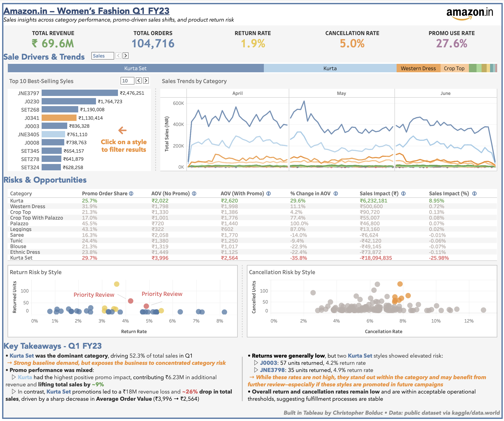

>This project focuses on Amazon India’s women’s fashion sales during Q1 FY2023. The goal was to turn raw sales data into a clear, insight-driven Tableau dashboard that highlights product performance, promotion effectiveness, and fulfillment trends.

>The final dashboard is built to support strategic planning by surfacing patterns in best-selling styles, return behavior, and order value shifts tied to promo usage.

# Women’s Fashion on Amazon.in: Insights & Forward Strategy
### Q1 FY2023 Sales Analysis & Growth Opportunities

> *Screenshot of the Tableau dashboard (Amazon.in - Women's fashion Q1 FY23)*  

[View the live version on Tableau Public](https://public.tableau.com/app/profile/christopherbolduc/viz/amazon_in_sales_q1fy23/Amazon_in-WomensFashionQ1FY23) <small>(Tip: Right-click or Cmd/Ctrl+Click to open in a new tab)</small>

## Key Insights

- **Top-Level KPIs**  
  Tracked core metrics including total revenue, order volume, return and cancellation rates, and overall promo usage.

- **Best-Selling Styles**  
  Identified styles driving the highest revenue in Q1 FY23, helping focus attention on core product winners.

- **Daily Sales Trends**  
  Line chart shows day-by-day sales performance to reveal seasonal shifts and category momentum.

- **Promotional Impact**  
  Evaluated promo effectiveness by category—tracking changes in AOV, revenue contribution, and overall sales impact.

- **Return & Cancellation Risk**  
  Scatter plots reveal styles with elevated return or cancellation rates, flagging priority items based on volume and percentage thresholds.

- **Dynamic Interactions**  
  Two toggles allow users to switch between Sales, Orders, and Units, and adjust the number of top styles displayed (Top 5, 10, or 25).

- **Narrative Summary**  
  A curated summary section provides key takeaways for merchandising and operations, helping translate data into action.

## Data Workflow Overview

This project followed a structured pipeline to convert raw marketplace data into a Tableau-ready dataset.

**Pipeline:** 

 
*Raw CSVs → Python Cleaning → SQL Modeling (Staging → Prep → Mart) → Tableau Dashboard*

### Python Cleaning  
Data was first cleaned using Python (`pandas`) and Excel to:
- Resolve formatting and encoding issues
- Normalize inconsistent values (e.g. category/style mismatches)
- Impute missing data where applicable
- Export cleaned files for SQL ingestion

### SQL Staging Layer  
Staging models standardized the raw inputs:
- Removed rows with invalid or mismatched status values
- Renamed key fields for consistency (e.g. `design_no` → `style`, `stock` → `qty`)
- Ensured consistent schemas across datasets

### SQL Prep Layer  
Prep models enriched and transformed the cleaned data:
- Introduced `status_clean` to standardize fulfillment status
- Calculated derived metrics like `avg_sales_per_unit`
- Flagged imputed values for traceability (`amount_filled`)
- Computed style-level metrics such as `style_total_sales` and `style_pct_of_state_sales`
- Consolidated key attributes (fulfillment type, courier status, etc.)

### SQL Mart Layer

The mart layer contains focused aggregations tailored for Tableau visualizations. Each view serves a specific analytical purpose:

- **`mart_amazon_volume`**  
  Aggregates monthly shipped volume by SKU, size, category, and promo usage  
  *Used to analyze unit volume trends across styles, with and without promotions*

- **`mart_amazon_promos`**  
  Summarizes shipped orders by category and style, segmented by promo application  
  *Drives promo performance comparisons and AOV analysis*

- **`mart_amazon_fulfillment_time_region`**  
  Tracks fulfillment outcomes (shipped, cancelled, returned) by date, location, and size  
  *Supports return/cancellation risk analysis*

- **`mart_amazon_category_b2b_state`**  
  Aggregates sales by category, B2B flag, state, and promo usage  
  *Used for supplemental exploration; not directly linked to dashboard visuals*

- **`mart_amazon_geo_sales`**  
  Captures daily sales by style and region (city/state)  
  *Not currently used in the dashboard but useful for potential geographic deep-dives*

### Tableau Dashboard Design  
The dashboard connects directly to mart-level SQL views. It uses parameter toggles, conditional formatting, annotations, and a narrative summary to guide users through key insights.

## Project Structure

    amazon_in_sales/
    ├── data/
    │   ├── raw/                            Original downloaded CSVs
    │   ├── category_disparities.csv        Used for Excel-based category/style cleanup
    │   └── category_disparities_fixed.csv
    │── cleaned_data/                       Final cleaned files used in the pipeline
    ├── models/
    │   ├── staging/                        Staging SQL views
    │   ├── prep/                           Enriched & cleaned transformation models
    │   └── mart/                           Aggregations for dashboard consumption
    ├── notebooks/                          Python notebooks for EDA, cleaning, testing
    ├── visuals/                            Tableau screenshot
    ├── .env                                Environment file containing DB/API credentials
    ├── .gitignore                          Git exclusion rules
    ├── LICENSE
    ├── README.md
    ├── requirements.txt

 
## Technologies Used
- **Tableau Desktop**  
  Built the interactive dashboard using parameter toggles, visual KPIs, and annotated narrative insights

- **PostgreSQL (via Supabase)**  
  Hosted and queried the cleaned datasets using Supabase’s cloud-based PostgreSQL environment

- **SQL (dbt-style layered modeling)**  
  Used staging, prep, and mart layers to transform raw data into analytical views

- **Python (pandas, SQLAlchemy)**  
  Cleaned and enriched data using Jupyter notebooks inside Visual Studio Code  
  SQLAlchemy was used for database connections and queries during pipeline development

- **Excel**  
  Assisted in early-stage reconciliation and cleanup (e.g. category mismatches)

## Setup Instructions

To replicate or build on this project:

1. Download the raw datasets from [data.world – Anil Sharma Amazon Dataset](https://data.world/anilsharma87).
2. Create and activate a Python environment (optional but recommended).
3. Install dependencies: `pip install -r requirements.txt`
4. Clean the data using Python (`pandas`) or use the cleaned `.csv` files provided.
5. Run the SQL scripts in the following order:
   - Staging views (`stag_*.sql`)
   - Preparation views (`prep_*.sql`)
   - Mart views (`mart_*.sql`)
6. Connect Tableau to the mart-level views (via Supabase) or export them as `.csv` for local development.

7. Customize or extend the dashboard by adjusting parameters, adding new charts, or connecting additional marts as needed.
 
## Disclaimer

This project is for educational and exploratory purposes only.

The dataset is simulated and publicly available via third-party sources.  
It is not affiliated with, endorsed by, or representative of Amazon Inc.

## License

This project is licensed under the MIT License. See the [`LICENSE`](LICENSE) file for details.

## Author

**Christopher Bolduc**  
[LinkedIn](https://www.linkedin.com/in/christopher-david-bolduc/) • [GitHub](https://github.com/christopherbolduc)
